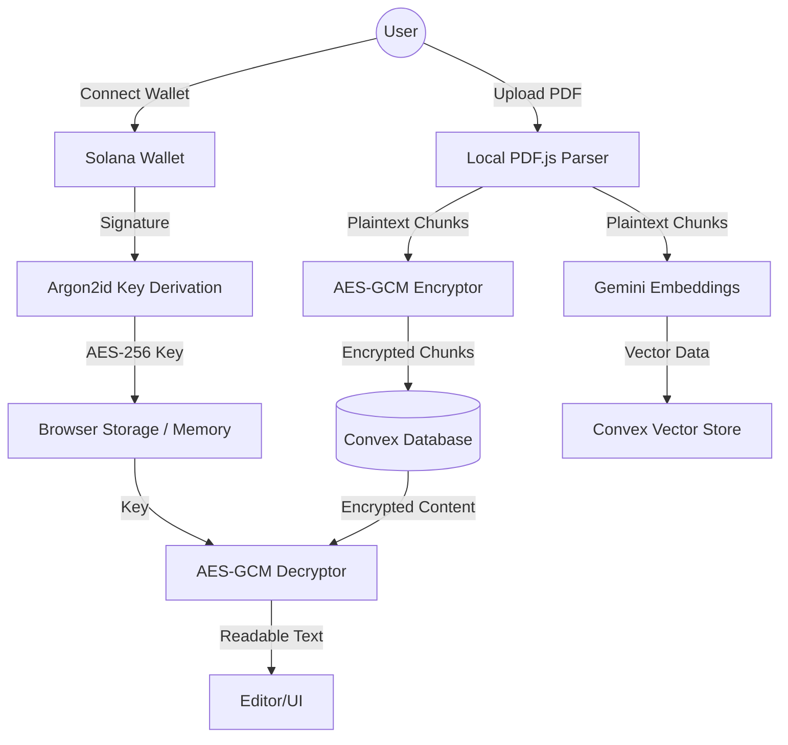

# AI PDF Notes: The Zero-Knowledge AI Platform

AI PDF Notes is a state-of-the-art web application that merges **Generative AI** with **Web3 Security** to provide a seamless, private environment for analyzing and interacting with PDF documents.

---

## 🚀 The Vision: Why This App is Unique
Most AI document tools require you to trust their servers with your data. **AI PDF Notes is different.** It is built on a "Zero-Knowledge" philosophy:
- **Privacy by Default**: Your documents are parses *on your device*.
- **Wallet-as-a-Key**: We use your Solana wallet not just for identity, but as the master physical key for your encryption.
- **AI without Compromise**: You get the full power of Google Gemini while keeping your data encrypted with industry-leading algorithms that even the developers cannot bypass.

---

## 🛠 Technology Stack

### Core Frameworks
- **Next.js 15 (App Router)**: For a blazing-fast, server-rendered frontend.
- **Convex (BaaS)**: A real-time backend and database that powers our vector search and file storage.
- **Clerk**: Secure, seamless user authentication.

### Artificial Intelligence
- **Google Gemini 2.5 Flash**: The brain of the app, handling complex summaries and Q&A.
- **Gemini Embedding-001**: Converts your text into multi-dimensional vectors for lightning-fast similarity search.
- **LangChain**: Orchestrates the communication between our vector store and the AI models.

### Security & Privacy
- **Solana Web3.js**: Interfaces with hardware/software wallets (like Phantom).
- **Argon2id (via hash-wasm)**: The "Gold Standard" memory-hard hashing function used for key derivation.
- **Web Crypto API (AES-256-GCM)**: Military-grade encryption for all stored data.

---

## 🏗 System Architecture

---

## 🔒 Masterclass in Privacy: No Room for Invasion

We have implemented a **Zero-Knowledge Architecture**. Here is how we guarantee your privacy:

### 1. The Solana Signature "Handshake"
When you activate Privacy Mode, you sign a unique message. This signature is cryptographically unique to your private key. 
- **Privacy Tip**: We never see your private key; we only see the resulting signature.

### 2. The Argon2id Shield
We pass your signature through **Argon2id**. Unlike standard hashes (which can be cracked by powerful computers), Argon2id is "memory-hard." It requires a specific amount of RAM to process, making it virtually impossible for an external attacker to brute-force your key using GPUs or specialized hardware.

### 3. Client-Side Parsing
Your PDFs are never "uploaded" to a server to be read. They are parsed into text strings **directly in your browser memory**. The raw, readable text of your PDF **never leaves your computer** without first being turned into an unreadable encrypted blob.

### 4. AES-256-GCM Encryption
We use **AES-256-GCM**, the encryption standard used by banks and governments. 
- **IV (Initialization Vectors)**: Every single piece of data is encrypted with a unique, random IV, ensuring that even if you have two identical notes, their encrypted versions will look completely different.

> [!IMPORTANT]
> **The Developer Guarantee**: Because the encryption key is derived from *your* wallet signature, no one—not Convex, not Clerk, and not us—can decrypt your notes. If we were to look at your data in our database, all we would see is a series of meaningless characters.

---

## 🔄 Core Workflows

### 📥 Ingestion & Contextualization
1. **Local Parse**: `pdfjs-dist` extracts text from the PDF.
2. **Chunking**: Text is broken into manageable context windows for the AI.
3. **Dual Path**:
    - **Path A**: Chunks are sent to Gemini to create **Vector Embeddings** (numbers representing meaning).
    - **Path B**: Chunks are **Encrypted** using your Argon2id-derived key.
4. **Storage**: Both the numbers (for search) and the encrypted text (for viewing) are saved to Convex.

### ✍️ AI-Powered Workspace
1. **Selection**: You highlight text in the viewer.
2. **Context Retrieval**: The app performs a "Similarity Search" in the Vector Store to find the most relevant parts of the document.
3. **Secure Decryption**: The matching chunks are pulled from the database and decrypted *locally* using your wallet key.
4. **AI Synthesis**: The relevant text is sent to Gemini 2.5 Flash to generate a summary or answer, which is then formatted in rich HTML for your editor.

---

## 🌟 Why It Matters
AI PDF Notes represents the future of productivity: where the power of Artificial Intelligence meets the absolute security of the Blockchain. You no longer have to choose between **convenience** and **privacy**.
